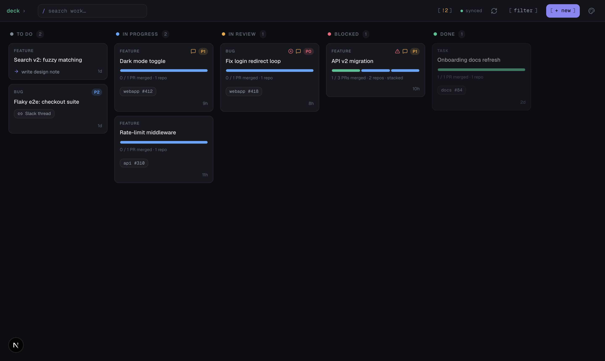
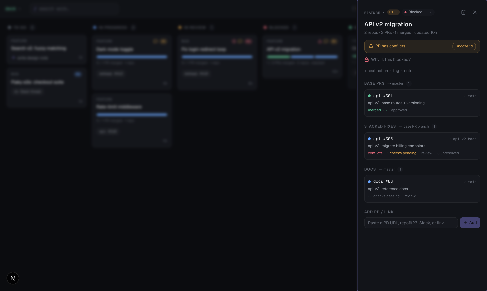
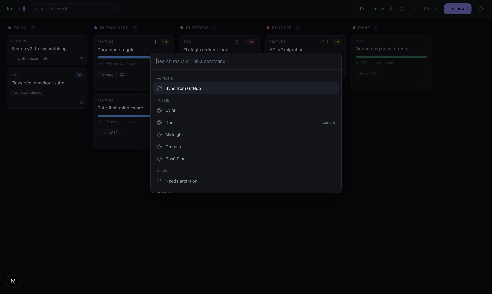
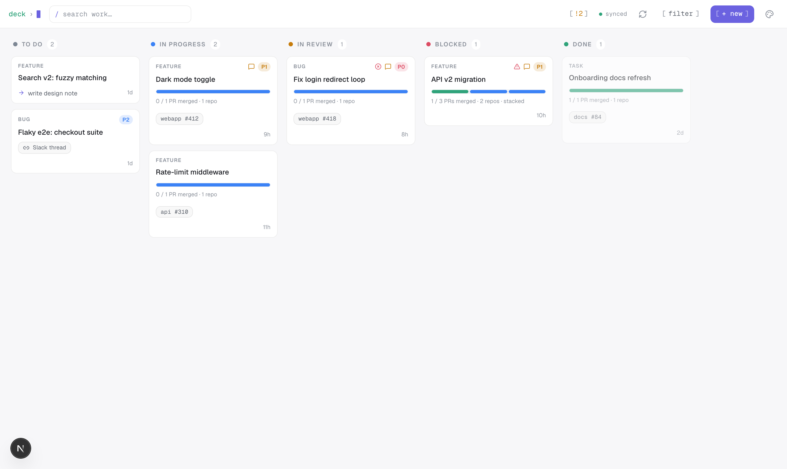

# Deck

**A fast, local kanban board for engineers who juggle lots of pull requests.**

Deck runs entirely on your machine. It tracks your features, bugs, and tasks on one board — and it talks to GitHub to show the *live state* of every PR you've linked: merged or open, failing checks, merge conflicts, unresolved review comments.

No account. No cloud. Just a local app and your GitHub (via `gh` or a token).



## What it does

**Everything on one board.** Five columns — To do, In progress, In review, Blocked, Done. Drag cards between them. Each card shows its PRs, how many are merged, and a progress bar.

**Live PR status from GitHub.** Hit sync (or let auto-sync do it) and every linked PR updates: state, failing checks, conflicts, and unresolved review threads. Cards that need your attention get flagged.

**All your PRs in one inbox.** The **PRs** tab pulls every open PR you authored or are reviewing, across every repo — sorted by what needs you first (failing checks, conflicts, changes requested → waiting on CI or review → ready to merge). Filter by health, repo, or role.

**Big work, many PRs.** One task can hold a whole initiative — a base PR, stacked PRs on top of it, and a docs PR — each with its own target branch, review state, and merge order:



**Keyboard-first.** Press `⌘K` for the command palette — search tasks, sync, switch themes, jump anywhere:



**Light mode too** (plus Midnight, Dracula, and Rosé Pine):



A few more nice things:

- Paste any link on a card — a GitHub PR, a Slack thread, a ticket, any URL.
- Move a card by hand and sync **won't** override your choice.
- Re-run failing GitHub Actions jobs and read their logs without leaving the board.
- Your data is one SQLite file (`deck.db`) sitting next to the code. Back it up by copying it.

## Set it up locally

You need **Node.js 20 or newer** — [download here](https://nodejs.org).

Then pick one of two ways to connect GitHub (only needed for live PR status; everything else works without either):

### Option A: with `gh` (zero config)

If you already use the [GitHub CLI](https://cli.github.com), log in once:

```bash
gh auth login
```

### Option B: with a Personal Access Token (no `gh` needed)

If you don't want to install `gh`, use a Personal Access Token instead — you'll paste it into Deck after it's running (see below). To make one:

1. Go to [github.com/settings/tokens](https://github.com/settings/tokens) → **Generate new token (classic)**.
2. Give it the **`repo`** scope (that's the only one Deck needs).
3. Copy it.

The token lives only in your browser's localStorage and is sent to your own local Deck server per sync. Nothing is stored server-side.

### Run it

```bash
git clone https://github.com/abhilashdvs/deck-next.git
cd deck-next
npm install
npm run dev
```

Open **http://localhost:9030** — that's it.

- If you chose **Option A**, you're done — sync just works.
- If you chose **Option B**, click the **gear icon** (top right) and paste your token into the settings popover. Hit **Save** (or **Test** to verify it first).

Click **+ new** to add your first task, then paste a PR URL into it. Or open the **PRs** tab and hit **sync** to pull in all your open PRs.

> Don't connect GitHub at all? Everything still works — you just won't get live PR status.

### Optional: PR shorthand

Typing a full PR URL works everywhere. If you want the short form too (`myrepo#123`), tell Deck which GitHub org/user to assume by creating a `.env.local` file:

```bash
echo 'NEXT_PUBLIC_GITHUB_ORG=your-github-org' > .env.local
```

## Everyday commands

| Command | What it does |
| --- | --- |
| `npm run dev` | Start the app at `localhost:9030` |
| `npm test` | Run the test suite |
| `npm run build` | Production build |

## How sync works (30 seconds)

When you sync, Deck asks your local `gh` CLI about each linked PR — state, checks, conflicts, review comments — plus one GraphQL call for unresolved review threads. Results are saved into `deck.db` and the board updates. Deck never stores a GitHub token; it simply uses the `gh` login you already have.

## Tech stack

[Next.js](https://nextjs.org) · React · TypeScript · [Drizzle ORM](https://orm.drizzle.team) over SQLite ([better-sqlite3](https://github.com/WiseLibs/better-sqlite3)) · [Tailwind CSS](https://tailwindcss.com) · [shadcn/ui](https://ui.shadcn.com) · [SWR](https://swr.vercel.app) · [dnd-kit](https://dndkit.com) · [cmdk](https://cmdk.paco.me)

## License

[MIT](./LICENSE)
